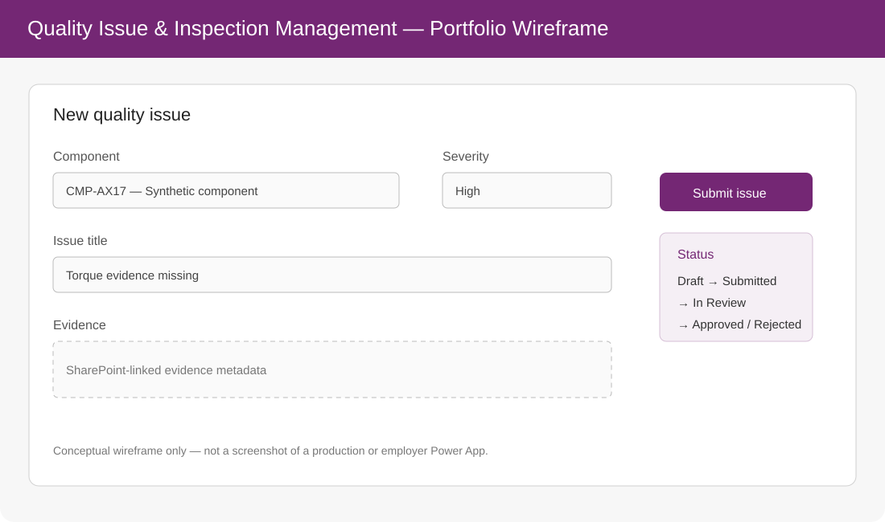

# Quality Issue & Inspection Management App — Power Platform Reference Design

[](https://github.com/lemoniadowyjohn/watson/actions/workflows/power-platform-docs-ci.yml)

> **Repository identity:** the slug `watson` is historical. The active branch now contains the **Power Platform Quality App reference design**. Earlier Jupyter coursework is preserved on the `legacy-watson-coursework` branch and has been removed from the active portfolio surface.

A public-safe reference implementation for an industrial quality workflow using Power Apps, Dataverse, Power Automate and SharePoint concepts.



> The visual above is explicitly a **portfolio wireframe**, not a screenshot of an employer or production Power App.

## Use case

```text
Power Apps issue form
        |
Dataverse Issue record
        |
business validation
        |
Power Automate approval
        |
SharePoint evidence storage
        |
status + audit history
        |
Teams / email notification
```

## What is documented

- normalized Dataverse entity model;
- Component, Inspection, Issue, Evidence, Approval and Status History records;
- representative Power Fx validation/search patterns;
- approval workflow with retry/idempotency considerations;
- SharePoint evidence-storage separation;
- role/security concepts;
- managed-solution and environment strategy;
- connection references and environment variables;
- DLP/least-privilege considerations;
- synthetic sample records;
- automated documentation-structure validation.

## Repository map

```text
schema/dataverse_tables.yaml       entity model
powerfx/issue_form.md              representative Power Fx
flows/issue_approval_flow.md       approval workflow design
governance/ALM_AND_SECURITY.md     ALM, roles and governance
samples/issues.csv                 synthetic records
docs/architecture.md               architecture
docs/ui_mockup.svg                 conceptual recruiter-facing UI
scripts/validate_docs.py           public documentation validation
```

## Portfolio status

This repository is intentionally classified as **PUBLIC SUPPORTING**, not a flagship code repository. It demonstrates Power Platform solution design and fills the Power Apps/Dataverse portfolio gap without pretending that a tenant-backed production app has been deployed.

A real Power Apps screenshot is therefore **not required for the current release gate**. If the design is later instantiated in a personal/developer tenant, real screenshots and a solution export can be added as a separate evidence upgrade.

## Evidence boundary

This repository does **not** claim prior professional Power Apps or Dataverse delivery.

It contains no:

- employer flow exports;
- tenant/environment identifiers;
- production SharePoint URLs;
- credentials;
- company/customer data;
- fabricated production screenshots.

Professional Microsoft 365/Power Automate experience and this Power Apps/Dataverse portfolio design should remain distinguishable in CV/LinkedIn wording.

## Related portfolio

- [Governed Agent Workflow Demo](https://github.com/lemoniadowyjohn/space-Y-)
- [Industrial Quality Documentation Assistant](https://github.com/lemoniadowyjohn/hermes)
- [CARLA Map Quality Toolkit](https://github.com/lemoniadowyjohn/carla-control-suite)
- [Python Excel Data Reconciliation Demo](https://github.com/lemoniadowyjohn/space-Y--)
