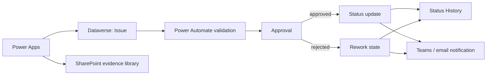

# Architecture

## Design principles

- Dataverse owns structured transactional state.
- SharePoint stores larger evidence files rather than embedding them in the main Issue table.
- Approval decisions are written back as separate auditable records.
- Status transitions append a StatusHistory record.
- The app design separates maker convenience from governance requirements.
